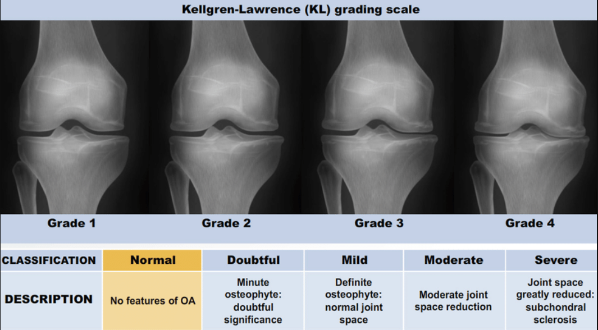
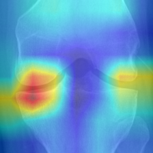
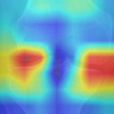
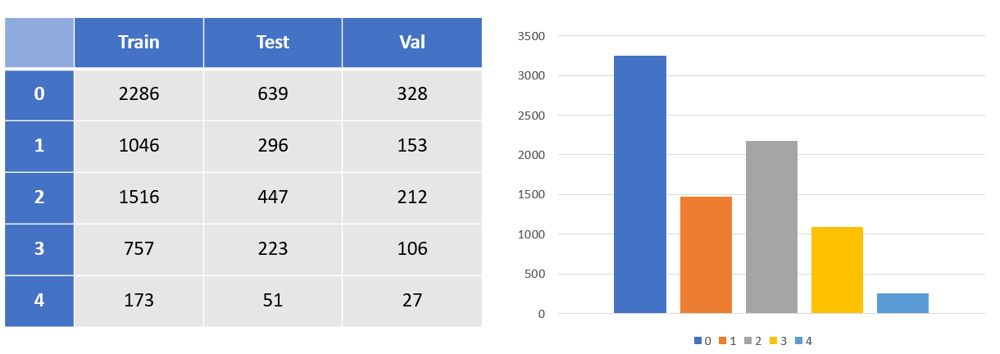
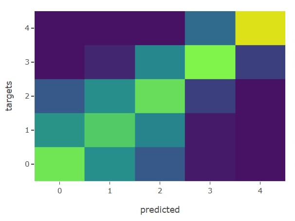
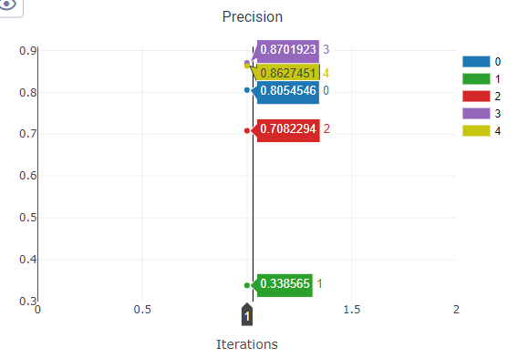
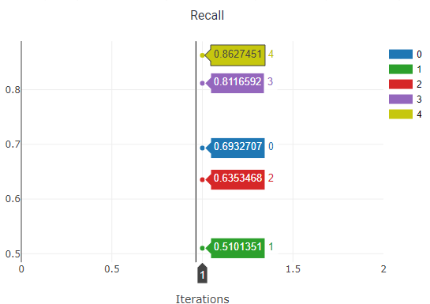

# Model Card
### KneesOA v0.0.1.
Сервсис по классификации артроза коленей по шкале KL Grade (0-4)

## Grad Cam

## Dataset

Датасет является сэмплом датасета [OAI](https://oai.epi-ucsf.org/datarelease/)

### Баланс классов

## ARCH

За бэйзлайн взята ResNeST с Radix First реализацией

### tweaks
* Более широкий и углубленный stem
* Конкатенация фичей с разных уровней перед подачей в полносвязный слой классификатора

## Training tweaks

* Шедулер уменьшающий LR когда метрики больше не растут (или падают :D) с подгрузкой бэст чекпоинта
* MPerClassSampler - просто хорошая вещь

## Ablation

* Resnet50+
* Densenet121+
* Вариации с ResNeST
  * Channel / Spatial Attention - (ну такое)
  * Шире, глубже, группы, радиксы и.тд
  * Конкатенации, суммации фичей на разных уровнях и с разных пулингов
  
TODO: <b> Завести трансформер </b>

## Test Metrics

**Balanced Accuracy**: 70.3

### Confusion Matrix

### Precision

### Recall

